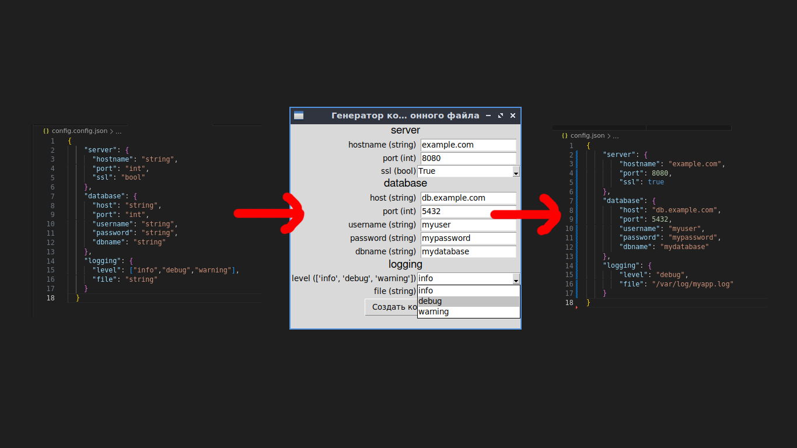

# Configurator3000

Надоело запоминать какие значения могу быть в полях вашего конфигурационного файла?\
Представляю вашему вниманию Configurator3000!\
Он подскажет вам какие значения предусмотрины у этого поля!\
Просто добавьте возможные значения в конфигурационный файл конфигурационного файла, и получайте удовольствие!\
Конфигурирование ещё никогда не было таким увлекательным!

## run

```sh
python3.10 ./configurator3000.py ./config.config.json ./config.json
```
